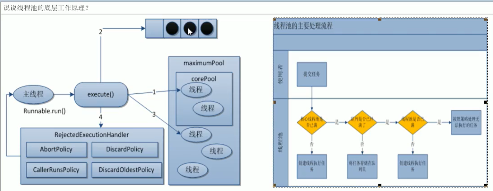

## JUC-并发包
> 学习并发包的相关内容，现对所学内容以及代码示例进行梳理和总结，巩固所学知识以便后续回顾。
>
* 关键字
    * volatile
        * [保证可见性](./src/main/java/pers/liangshan/demos/juc/VolatileDemo.java)
        * [不保证原子性](./src/main/java/pers/liangshan/demos/juc/VolatileDemo.java)
        * [DCL-单例模式](./src/main/java/pers/liangshan/demos/juc/SingletonDCLDemo.java) 
    * synchronized
        * 既保证可见性也保证原子性
        * 实现原理
        * 优化点
    * final
* 并发工具
    * [Atomic-保证原子性](./src/main/java/pers/liangshan/demos/juc/VolatileDemo.java)
    * [CountDownLatch：一个线程等多个线程](./src/main/java/pers/liangshan/demos/juc/CountDownLatchDemo.java)
    * [CyclicBarrier:一组线程互相等待至某个状态](./src/main/java/pers/liangshan/demos/juc/CyclicBarrierDemo.java)
    * [Semaphore-信号量](./src/main/java/pers/liangshan/demos/juc/SemaphoreDemo.java)
* 并发容器
    * [BlockingQueue-阻塞队列](./doc/BlockingQueue.MD)
    * ConcurrentHashMap-线程安全的Map
    * CopyOnWriteArrayList-线程安全的List
* 线程池
    * [ThreadPoolExecutor：7大参数及工作原理](./doc/ThreadPoolExecutor.md)
    * 