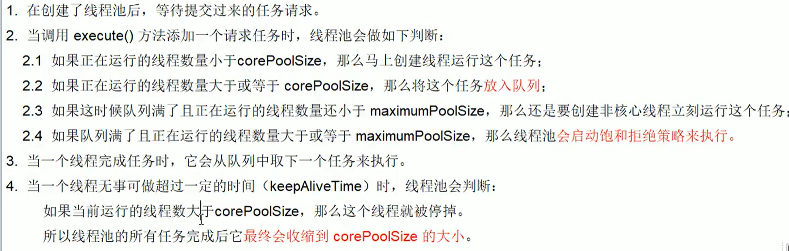

## ThreadPoolExecutor-7大参数
1. corePoolSize:线程池中的常驻核心线程数
2. maximumPoolSize:线程池能够容纳同时执行的最大线程数,此值大于等于1
3. keepAliveTime:多余的空闲线程存活时间,当空间时间达到keepAliveTime值时,多余的线程会被销毁直到只剩下corePoolSize个线程为止
4. unit:keepAliveTime的单位
5. workQueue:任务队列,被提交但尚未被执行的任务.
6. threadFactory:表示生成线程池中工作线程的线程工厂,用户创建新线程,一般用默认即可
7. handler:拒绝策略,表示当线程队列满了并且工作线程大于等于线程池的最大线程数(maxnumPoolSize)时如何来拒绝.
***
## 工作原理

## 文字描述

